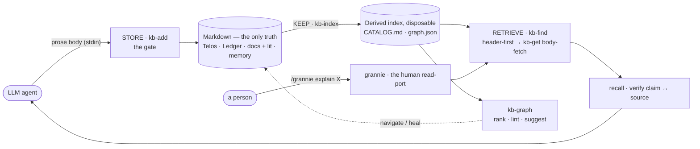
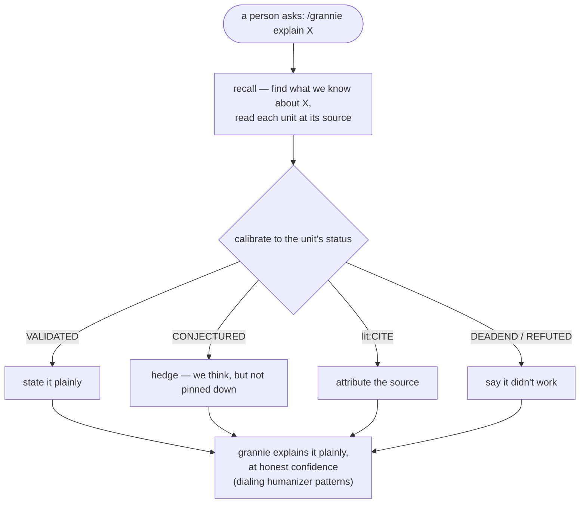

<div align="center">

# Promptus

**Store what your research knows. Retrieve it with its confidence attached. Write only what you can defend.**

[](https://github.com/Gavin-Qiao/promptus/actions/workflows/ci.yml)
[](LICENSE)
[](https://bun.sh)

</div>

A file-based research knowledge system for Claude Code — a knowledge **substrate for the LLM agent**
doing the research. Promptus **stores / keeps / retrieves** everything a project knows — events (the
ledger, right and wrong), external literature, distilled findings, durable memory — as gated,
well-formed markdown, so the agent's reasoning and writing stay grounded and honest. A human reads in
through one port: **grannie**, which explains any stored concept in plain language at honest confidence.

> Latin *promptus* — "brought forth, ready, at hand": the store from which knowledge is brought
> out and made ready — to write, to recall, to hand off.

## Design philosophy

One bet underwrites the whole system: **the same virtues that make prose *human* make research
*trustworthy*** — calibrate to the evidence, name your sources, keep your dead-ends. Five
principles follow.

1. **Markdown is the only source of truth.** Everything a project knows is plain, readable
   markdown you could open with no tools at all. The derived index (`.promptus/`) is *disposable*
   — rebuilt on demand, never authored. Lose it and nothing is lost.

2. **Every write goes through a gate.** Knowledge enters through one script, never freehand. The
   script owns the envelope, the timestamp, the id, the placement, and a controlled vocabulary —
   so format *can't* drift, because nothing is hand-typed. Friction is what makes a lab notebook
   rot; the gate removes it.

3. **Every unit carries its epistemic status.** A claim is tagged with where it stands —
   `CONJECTURED`, `VALIDATED`, `REFUTED`, a `DEADEND`. Retrieval hands back facts *with their
   confidence attached*, so what you write calibrates to what you actually know. This is the hinge
   between honest prose and honest research.

4. **A header beats a vector — at this scale.** For a small, dense, status-tagged corpus a
   hand-written header is a better retrieval key than an embedding, and the `[[wikilinks]]`
   already *are* the graph. So v1 has no embeddings and no database. The heavy machinery turns on
   only past a threshold you have **measured** — never on spec.

5. **Prefer a script over a server.** The mechanics are a handful of TypeScript files on bun,
   stdlib-first. Nothing to host, nothing to vendor, nothing to keep running.

> **The invariant** — markdown is the only source of truth · the index is derived & disposable ·
> writes go through a gated script, never freehand · prefer a script over a server · add machinery
> (embeddings, a DB) only past a threshold you've **measured**.

*Kindred to Andrej Karpathy's [llm-wiki](https://gist.github.com/karpathy/442a6bf555914893e9891c11519de94f)
pattern — persistent, LLM-maintained markdown over raw sources, instead of re-retrieving on every
query. Promptus makes the append-only **ledger** the spine and adds a gate, epistemic status, and
renderers.*

## Quick start

Promptus is a Claude Code plugin. Install it:

```
/plugin marketplace add Gavin-Qiao/promptus
/plugin install promptus@promptus
```

…or from the CLI: `claude plugin marketplace add Gavin-Qiao/promptus` then
`claude plugin install promptus@promptus`. Installing brings the bundled `scripts/`; the skills,
commands, and templates resolve them via `${CLAUDE_PLUGIN_ROOT}` — nothing to copy in.
**Requires** [bun](https://bun.sh) ≥ 1.3 (the scripts are TypeScript on bun).

Stand up the four stores in a repo:

```
/promptus:promptus-init
```

Then just work — tell Claude what happened, and the `research-ledger` skill records it through the
gate. The three verbs, under the hood:

```bash
# STORE — body on stdin; the script owns the timestamp, id, placement, and the gate
echo "Chose bun so bun:sqlite is a one-line upgrade later." \
  | bun scripts/kb-add.ts --substrate ledger --kind DECISION --status VALIDATED --title "Chose bun"

# KEEP — rebuild the derived card-catalog + link graph
bun scripts/kb-index.ts

# RETRIEVE — header-first, every hit tagged substrate:status
bun scripts/kb-find.ts "bun"
```

(Inside the Promptus repo the scripts are `bun scripts/…`; inside another project the skills
resolve them via `${CLAUDE_PLUGIN_ROOT}`.) Before you compact a session,
`/promptus:checkpoint` flushes anything unrecorded into the stores. New to the system?
`/promptus:help`.

## Architecture — four stores · three verbs · one human read-port



**Four stores** (per project), each unit tagged `substrate:status`:

| store | path | example tag |
|---|---|---|
| Telos | `.promptus/TELOS.md` | — (direction) |
| Ledger | `.promptus/ledger/RESEARCH-LEDGER.md` | `ledger:DEADEND` |
| Knowledge | `.promptus/docs/` (findings) + `.promptus/docs/lit/` (literature) | `finding:VALIDATED`, `lit:CITE` |
| Memory | `.promptus/memory/` (one file per fact) | `memory:validated` |

**Three verbs** — the mechanics are scripts, the reasoning is skills:

- **STORE** → `scripts/kb-add.ts`, the gated writer-jig. The LLM supplies only the prose body
  (stdin); the script owns the envelope, the local timestamp, the id, the placement, the index,
  typed relations, and the **hybrid gate** — *strict* for the curated library (finding/lit/memory:
  off-vocab input is refused with the allowed set), *permissive* for the lab-notebook ledger (an
  off-vocab kind/status is warned about but still written). `kb-export` emits the relation graph as
  CiTO/PROV-O JSON-LD.
- **KEEP** → `scripts/kb-index.ts` (rebuild the derived `.promptus/cache/CATALOG.md` card-catalog +
  `graph.json`, resolve supersedes, lint orphans / unresolved links), `scripts/kb-graph.ts lint`
  (graph health: dangling `[[handles]]` with a "did you mean?", orphans), + `/promptus:checkpoint`.
- **RETRIEVE** → two tiers. `scripts/kb-find.ts` (header-first — read the card-catalog, grep bodies,
  walk the `[[link]]` graph, filter by status) says *which* units; `scripts/kb-get.ts` then returns a
  single unit's body — one ledger entry's slice, not the whole 140 KB file. The `recall` skill drives
  both (decompose → retrieve → confidence-gate → verify → synthesize). `scripts/kb-graph.ts` navigates
  the graph itself: `rank` (PageRank — the load-bearing units) and `suggest` (latent links —
  related-but-unlinked pairs to connect, by shared vocabulary + shared source).

**The human read-port.** The agent operates the verbs above; a human reads in through **`grannie`** —
`/grannie explain <concept>` retrieves from the store and answers in plain language, grounded and
honest about confidence (a `CONJECTURED` claim is hedged, a `DEADEND` named). It's the one
human-initiated loop. Two more skills support the agent's *own* writing — not a separate audience:

- `humanizer` — a **style toolkit** (de-AI, human-voice patterns) that grannie dials to maximum
  accessibility and the agent applies to its own prose. Pure style; it never touches the store.
- `recall` + the **`grounded-writing-reviewer`** agent — the **agent-side grounding audit**: retrieve a
  draft's claims, check each against its source, flag anything unsourced or louder than its status allows.

Every hit carries its status, so an answer is *calibrated to what we actually know* — the hinge
between honest prose and honest research. It shows most plainly at the human read-port, **grannie**:



## The papers-scale crossing

The *scriptable* graph layer already ships at notes-scale, no embeddings: `kb-graph rank` is
personalized-PageRank over the `[[link]]` graph, `kb-graph suggest` a lexical latent-link linter
(shared vocabulary + shared source). What still defers is the **embedding-scale** version. When the
corpus becomes hundreds–thousands of *papers* (not one project's notes), the header catalog stops
fitting one read and that machinery turns on — each past a measured threshold, into the existing
seams: schema-constrained ingestion → embeddings as a pre-filter scoped to `.promptus/docs/lit` →
embedding-based latent links and community summaries over the literature → recursive summary tiers.
The invariant still governs. The full roadmap and the prior-art audit are in
[`.promptus/docs/report.md`](.promptus/docs/report.md) and
[`.promptus/docs/promptus-vs-kag-coverage.md`](.promptus/docs/promptus-vs-kag-coverage.md).

## Commands & skills

| command | what it does |
|---|---|
| `/promptus:help` | the map — stores, verbs, and where to start |
| `/promptus:promptus-init` | scaffold the four stores + the `AGENTS.md` cadence in a repo (idempotent) |
| `/promptus:checkpoint` | minimal pre-compaction flush — store what's unrecorded, refresh the NOW-header |
| `/promptus:promptus-doctor` | diagnose & migrate a repo's Promptus layout to the current namespace + vocab |
| `/promptus:promptus-ingest` | curate deep-research notes into `lit:` units (backfill sources, promote findings) |
| `/promptus:promptus-graph` | inspect the knowledge graph — `rank` (PageRank), `lint` (health), `suggest` (latent links) |

| skill | role |
|---|---|
| `promptus` | orchestrator — picks the right verb / script / skill |
| `research-ledger` | the store-as-you-go recording habit (append via `kb-add`, never freehand) |
| `recall` | retrieval reasoning — decompose → `kb-find` → verify each claim → synthesize |
| `humanizer` | writing renderer — paper voice, pure style |
| `grannie` | plain-language ELI90 renderer for a stored concept |
| `telos` | scaffold a project's four stores, Telos first |

Plus the **`grounded-writing-reviewer`** agent — audits a draft for AI-writing tells *and* for
unsourced or over-confident claims, checking each against the store.

## Hooks (optional)

When the plugin is enabled, four hooks activate — each a strict no-op outside a
Promptus-initialized repo (no `.promptus/` project), so other projects are untouched:

- **SessionStart** injects the ledger's NOW-header, so a resuming agent wakes up oriented.
- **PreToolUse** blocks freehand writes that add a `### [ts]` log line or touch `.promptus/cache/`,
  pointing at `kb-add` — the gate, enforced. Editing the NOW-header (at `/promptus:checkpoint`)
  stays allowed.
- **PostToolUse** re-runs `kb-index` after a `kb-add`, so the derived catalog never drifts.
- **SessionEnd** nudges you to `/promptus:checkpoint`.

To disable any of them, remove its entry from [`hooks/hooks.json`](hooks/hooks.json), or turn off
the plugin's hooks in your Claude Code settings.

## Layout

```
scripts/    kb-add · kb-now · kb-index · kb-find · kb-get · kb-graph · kb-export · ledger-append · validate-plugin · changelog · lib/ · test/
skills/     promptus (orchestrator) · humanizer · recall · grannie · research-ledger · telos
commands/   help · checkpoint · promptus-init · promptus-doctor · promptus-ingest · promptus-graph
agents/     grounded-writing-reviewer
hooks/      session-start · protect-gate · auto-index · checkpoint-nudge (+ hooks.json)
templates/  the per-project scaffolds (incl. the default schema/kb-vocab.json)
.promptus/  Promptus using itself — TELOS · ledger · docs (findings + lit) · memory · schema (cache/ is derived)
```

## Development

```bash
bun test                       # the store-spine tests
bun run check                  # plugin validator + tests
claude plugin validate         # the full plugin check (needs the Claude CLI)
```

Promptus **dogfoods** its own methodology: it maintains its own `.promptus/` stores (TELOS, ledger,
docs, memory) through its own scripts. If the toolbox can't hold its own design history, it isn't ready.
Contributions go through `.pre-commit-config.yaml` (hygiene on commit, validator + tests on push)
and CI. See [`CONTRIBUTING.md`](CONTRIBUTING.md) for the conventions and
[`RELEASING.md`](RELEASING.md) for how releases are cut; changes are recorded in
[`CHANGELOG.md`](CHANGELOG.md).

## License & attribution

Promptus is free software, licensed under the **GNU General Public License v3.0**
(© 2026 Mohan Qiao) — see [`LICENSE`](LICENSE). If you distribute it or a derivative, that
work must also be GPL-3.0: share your usage back.

The [`skills/humanizer`](skills/humanizer/SKILL.md) skill is an extended fork of
[blader/humanizer](https://github.com/blader/humanizer) by Siqi Chen. Its upstream "Part I" was
MIT-licensed; that notice is preserved in [`NOTICE`](NOTICE), as MIT requires.
